# Thread Tester
Some tests of various Linux threading libraries.

# Requirements
* A POSIX-compatible system with pthread
* CMake 2.8 or later
* Python 2.7.x
* NumPy 1.8 or later
* MatPlotLib 2.2 or later
* Boost thread library 1.54 or later
* gcc + standard libraries

# Summary
This project is designed to compare the performance of various threading systems.

## Test Descriptions
|Name|Description|
|----|-----------|
|thread_start|Time between immediately before the thread creation function is called and the first execution of that thread.|
|thread_shutdown|Time between immediately before a thread terminates and when the creator of the thread receives notification that the thread shut down.|

## Details
Each line in the following table represents the execution of one of the binaries in this repository.
For each one, the following information is listed:
* The language the program was written in.
* The library (if any) used to run the tests.
* The test that was performed.
* Details on the timing of the results.

# Results

## Test: Thread Shutdown
|Description|1st Gen Intel Core i7|Raspberry Pi B2|
|-----------|---------------------|---------------|
|C++ - boost::thread|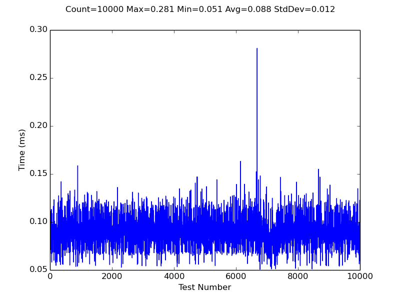|
|C++ - pthread|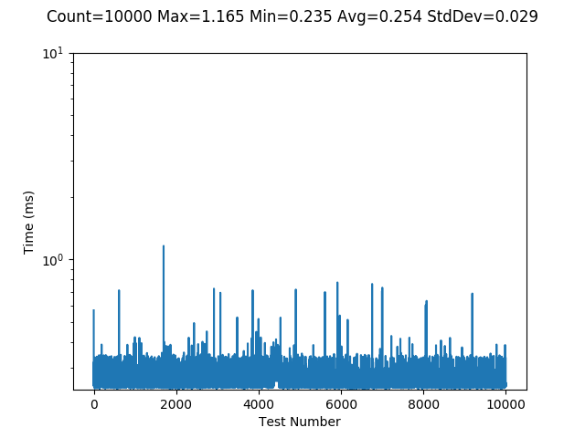|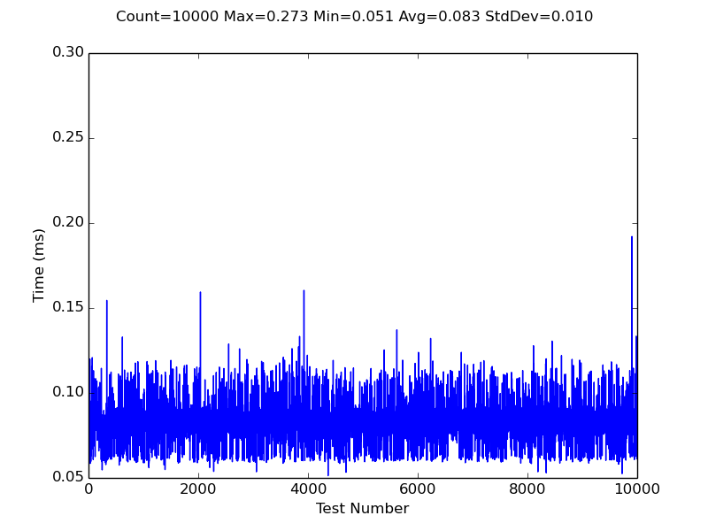|
|C++ - std::async||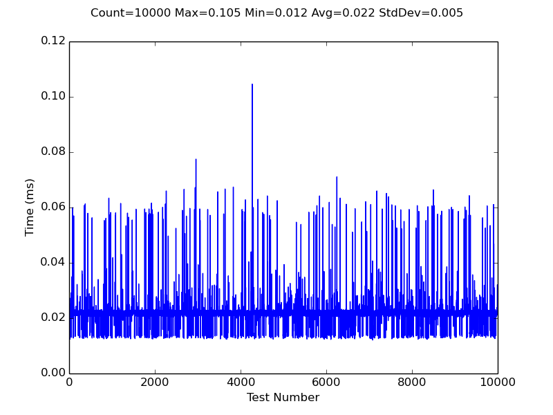|
|C++ - std::thread|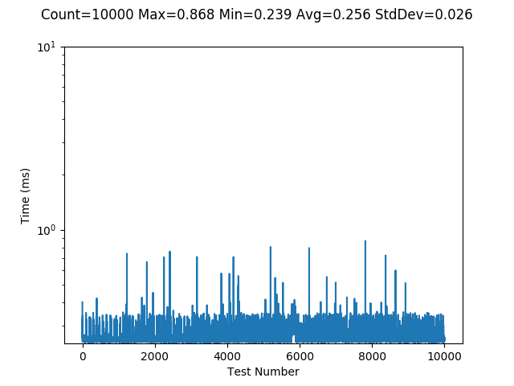|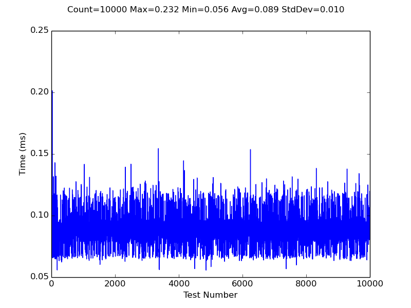|
|C - pthread|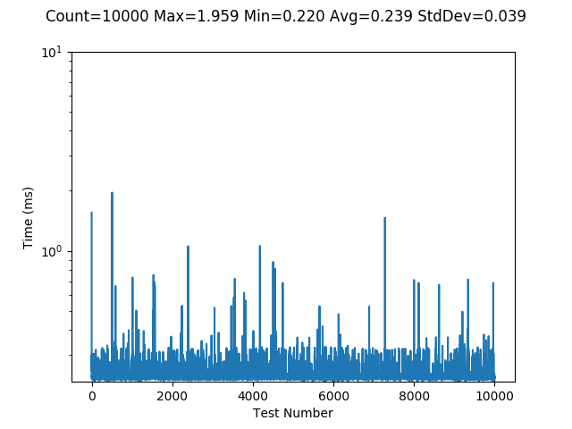|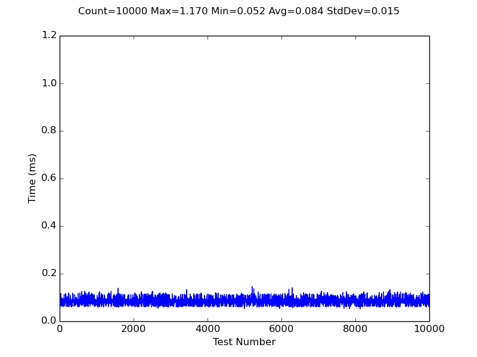|

## Test: Thread Startup
|Description|1st Gen Intel Core i7|Raspberry Pi B2|
|-----------|---------------------|---------------|
|C++ - boost::thread|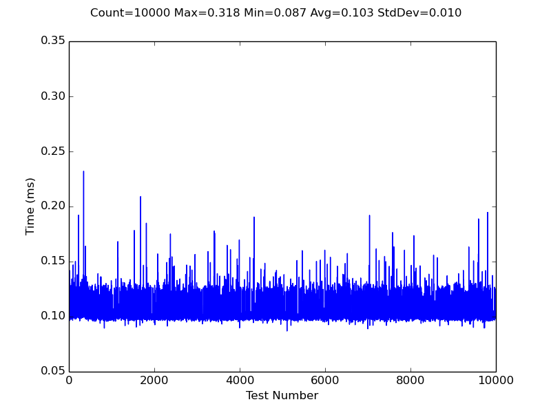|
|C++ - pthread|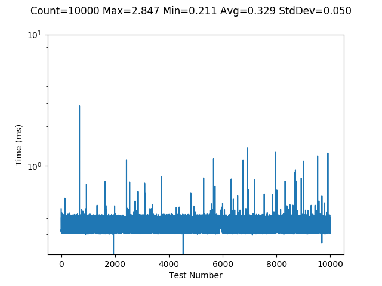|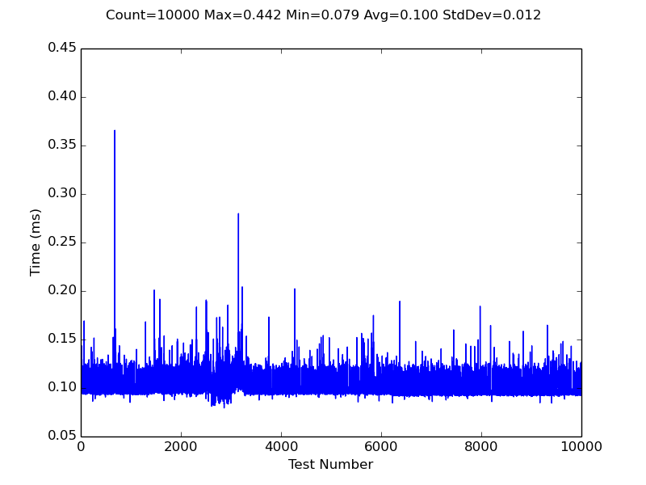|
|C++ - std::async|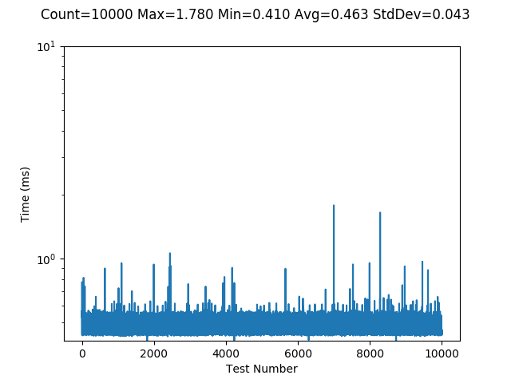|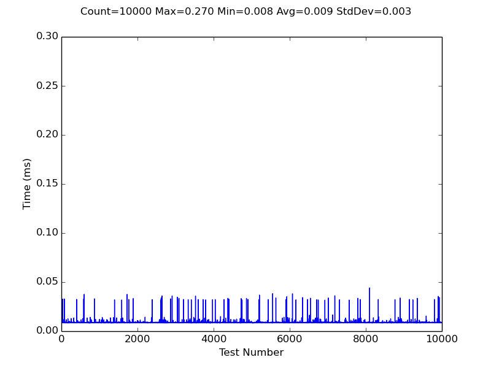|
|C++ - std::thread|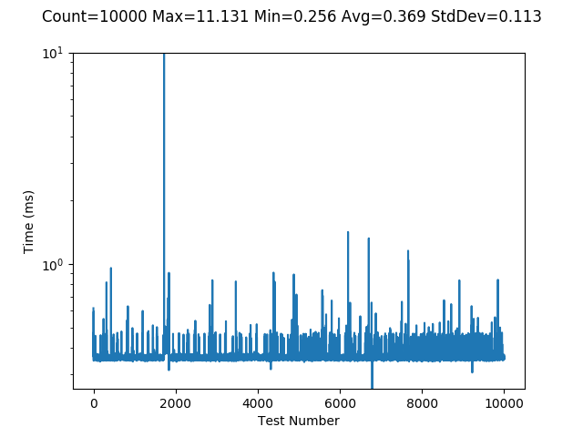|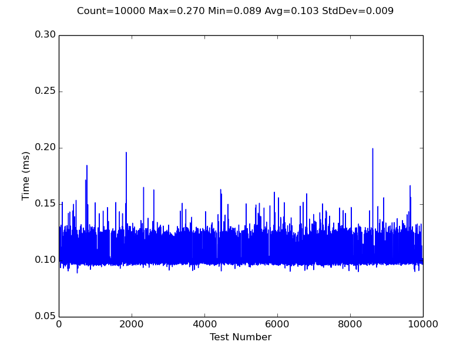|
|C - pthread||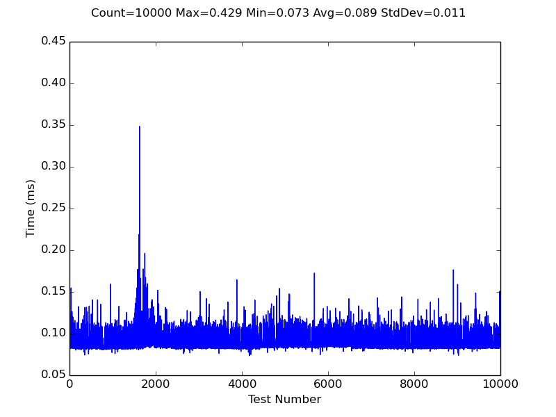|
